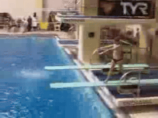
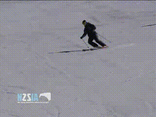
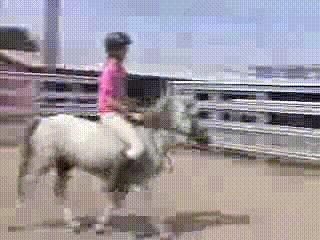
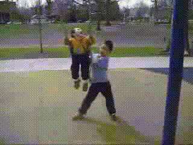

<div align="center">
  
# Classification of Human Movements in Time Series Using Long Short-Term Memory (LSTM)
  
[](https://github.com/MarcosTavar3s/LSTM_Classifier/blob/main/LICENSE) [](https://www.python.org/) [](https://www.tensorflow.org/)
</div>

---

## 📋 Description 
This project evaluates the performance of a Long Short-Term Memory (LSTM) architecture for human movement classification in the UCF50 dataset. 

---

## 📜 Summary
- [1. Introduction](#1-introduction)
- [2. Architecture](#2-architecture)
- [3. Methodology](#3-methodology)
  -   [3.1. Classes](#31-classes)
  -   [3.2. Quantity of Frames](#32-quantity-of-frames)
  -   [3.3. Performance Evaluation](#33-performance-evaluation)
- [4. Module.py methods](#4-modulepy-methods)
- [5. Results and Discussion](#5-results-and-discussion)
- [6. Conclusion](#6-conclusion)
- [7. Future Steps](#7-future-steps)
- [8. Running Locally](#8-running-locally)
- [9. Developer Team](#9-developer-team)
- [10. References](#10-references)
- [11. License](#11-license)

---
## 📂 Project Tree
```
LSTM_Classifier/
├── code/
|   ├── examples/ # videos to test the network
│   ├── module.py
│   ├── test.py
│   ├── train.py
|   ├── requirements.txt
├── statistics/ # statistic results
├── README.md
└── LICENSE
```
---

## 1. Introduction
Human movements consist of actions that cannot be properly classified by one image alone, but rather by a set of images in a specific sequence. In this context, the goal of this project is to address the problem of identifying movements by using multi-frame containers (videos) and creating a time-series neural network module. To achieve this goal,  a Long Short-Term Memory (LSTM) architecture was chosen due to its ability to retain information from previous steps. Furthermore, to evaluate the network, different frame inputs were tested from 15 to 120 frames.

Regarding the dataset, this study utilizes Realistic Action Recognition: UCF50 [[1](https://www.kaggle.com/datasets/pypiahmad/realistic-action-recognition-ucf50/code)]. The main reasons for this choice are: the variety of human movement and consistency in usage worldwide.
<br>

<div align="center">

| Diving | HorseRace | Mixing |
| :-----: | :-----: | :-----: |
|  |  |  

  _Example of Diving, HorseRace, and Mixing classes in UCF50 dataset_
  
</div>

---

## 2. Architecture
To carry out this study, based on Bleed AI Academy’s Youtube video [[2](https://www.youtube.com/watch?v=QmtSkq3DYko)], the following architecture of LSTM was used:
<pre> 
                              ------------------------------------------------
                              |                 ConvLSTM2D                   |
                              ------------------------------------------------
                              |   Filters=4, Kernel=(3,3), Activation=Tanh   |
                              ------------------------------------------------
                                                   ↓
                              ------------------------------------------------
                              |                MaxPooling3D                  |
                              ------------------------------------------------
                              |       Padding=Same, Pool_Size=(1,2,2)        |
                              ------------------------------------------------
                                                   ↓
                              ------------------------------------------------
                              |        TimeDistributed + Dropout             |
                              ------------------------------------------------
                              |                Dropout=0.2                   |
                              ------------------------------------------------
                                                   ↓
                              ------------------------------------------------
                              |                 ConvLSTM2D                   |
                              ------------------------------------------------
                              |   Filters=14, Kernel=(3,3), Activation=Tanh  |
                              ------------------------------------------------
                                                   ↓
                              ------------------------------------------------
                              |                MaxPooling3D                  |
                              ------------------------------------------------
                              |       Padding=Same, Pool_Size=(1,2,2)        |
                              ------------------------------------------------
                                                   ↓
                              ------------------------------------------------
                              |        TimeDistributed + Dropout             |
                              ------------------------------------------------
                              |                Dropout=0.2                   |
                              ------------------------------------------------
                                                   ↓
                              ------------------------------------------------
                              |                 ConvLSTM2D                   |
                              ------------------------------------------------
                              |   Filters=16, Kernel=(3,3), Activation=Tanh  |
                              ------------------------------------------------
                                                   ↓
                              ------------------------------------------------
                              |                MaxPooling3D                  |
                              ------------------------------------------------
                              |       Padding=Same, Pool_Size=(1,2,2)        |
                              ------------------------------------------------
                                                   ↓
                              ------------------------------------------------
                              |                  Flatten                     |
                              ------------------------------------------------
                                                   ↓
                              ------------------------------------------------
                              |                  Dense                       |
                              ------------------------------------------------
                              |        6 classes, Activation=SoftMax         |
                              ------------------------------------------------
  </pre>


---

## 3. Methodology
### 3.1. Classes
Initially, to assess which configuration presents the best performance, it was decided to fix the number of classes to seven: WalkingWithDog, Skiing, Swing, Diving, Mixing, HorseRace, and HorseRiding. The classes are encoded with One-Hot Encoded Labels (no need for ordering among themselves).

<div align="center">

| Skiing | HorseRiding | Swing |  WalkingWithDog |
| :-----: | :-----: | :-----: | :-----: |
|  |  |  |  |

_Example of Skiing, HorseRiding, Swing and WalkingWithDog classes in UCF50 dataset_

</div>

### 3.2. Quantity of Frames
After that establishment, the next step was to alter the quantity of collected frames from 15 to 120 frames. There, I trained each network in 5 epochs to expect an overall performance, and subsequently selected the more efficient ones for longer training (30 epochs). 

### 3.3. Performance Evaluation
For matters of evaluation, metrics such as loss, accuracy, recall, and precision were the backbone to appoint the best network for this context. Finally, the assessment was deemed successful.

---

## 4. Module.py methods
As a side effect of this study, I created a structured and oriented module for the LSTM architecture shown above. The main methods are:
  
| **Method** | **Description**       |
|-------|-----------------|
| create_dataset | creates a dataset from the input path |
| frame_features_extraction | extract features from each class and store to create the dataset |
| architecture | assemble the LSTM architecture |
| predict | predict an input video and store it in an output file |
| train | train the LSTM model (train: 70, val: 15, test: 15) |
| evaluate | generate a .json with loss, accuracy, precision, and recall metrics |
| load_model | load an existent model |
| save_architecture_image | save an image of the LSTM architecture |
| save_metric | save training metrics over epochs in a .csv |

---

## 5. Results and Discussion
Initially, the metrics of mean loss, accuracy, precision, recall, and training time for each trained model will be discussed.

---

## 6. Conclusion
The study demonstrated that LSTMs are a solution to human movement classification problems. Despite using a small and educational dataset, the trained model presented satisfactory results.  Furthermore, it is worth noting that, in terms of the UCF50 dataset, the overall best setting happens when 60 frames are captured from each video. 

---

##  7. Future Steps
It is worth noting that this repository is only a scratch of LSTM's potential to tackle problems concerning the identification of human movements. For the future, adding the capacity of continuous learning, designing an accessible user terminal to execute functions (such as training, creating a dataset, evaluating performance), and testing different architectures are possible implementations.

---
## 8. Running Locally
📥 Clone the repository:
```bash
git clone https://https://github.com/MarcosTavar3s/LSTM_Classifier.git
cd code
```

🐍 Create and activate a virtual environment:
```bash
python3 -m venv venv
source venv/bin/activate # Linux or MacOS
venv/Scripts/activate # Windows
```

📦 Install the dependencies:

```bash
pip install -r requirements.txt
```

🚀Run the project:
```bash
python train.py # for training
python test.py # for testing
```

📌To use only module.py, import in your python code:
```python
from lstm import classifier_model
```
---

## 9. Developer Team
| [](https://github.com/MarcosTavar3s) | [](https://github.com/heltonmaia) |
| :-----------------------------------------------------------------------------------: | :-----------------------------------------------------------------------------: |
|                           **Marcos Aurélio**<br> Researcher                           |                       **Helton Maia** <br> Academic Advisor                     |

---
## 10. References
[1] P. Ahmad, "Realistic Action Recognition - UCF50," Kaggle, 2022. [Online]. Available: [https://www.kaggle.com/datasets/pypiahmad/realistic-action-recognition-ucf50](https://www.kaggle.com/datasets/pypiahmad/realistic-action-recognition-ucf50).

[2] Bleed AI Academy, "Human Activity Recognition using TensorFlow (CNN + LSTM) | 2 Methods", YouTube, 2021. [Online]. Available: [https://www.youtube.com/watch?v=QmtSkq3DYko](https://www.youtube.com/watch?v=QmtSkq3DYko).

---

## 11. License
This project is licensed under the terms of the [MIT License](https://github.com/MarcosTavar3s/LSTM_Classifier/blob/main/LICENSE).
